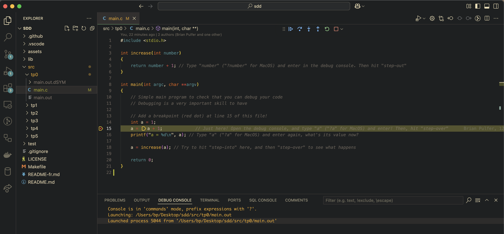
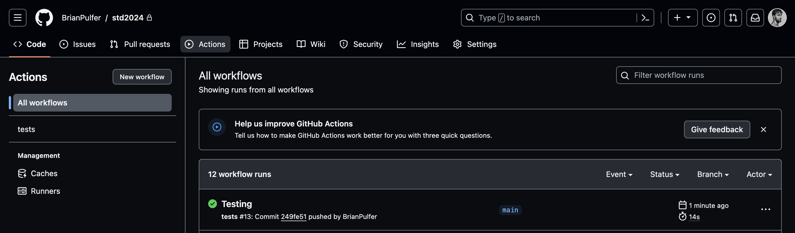

# Exercices sur les structures de données (printemps 2025) - Université de Genève

## Contenu
- **TP0** : Introduction à C et VSCode (s'assurer que vous savez déboguer)
- **TP1** : Types de données simples et pointeurs
- **TP2** : Pile, file, liste
- **TP3** : Arbres, arbres AVL
- **TP4** : Graphes
- **TP5** : Hachage, tables de hachage, chaînage, sondage linéaire

## Configurer l'environnement local
### VSCode
S'il n'est pas installé, téléchargez et installez [Visual Studio Code](https://code.visualstudio.com/). Installez-le avec :

- **Linux :** `sudo apt-get install code`
- **MacOS :** depuis le [site Web](https://code.visualstudio.com/)
- **Windows :** depuis le [site Web](https://code.visualstudio.com/)

Assurez-vous d'installer l'[extension C/C++](https://marketplace.visualstudio.com/items?itemName=ms-vscode.cpptools) pour VSCode. Cela devrait fournir des fonctionnalités d'intellisense, de navigation dans le code et de débogage.

### Windows
Si vous êtes sous **Windows**, suivez ces [étapes](https://www.youtube.com/watch?v=-gxwT-eAfvU) :
1) installez [MSYS2](https://www.msys2.org/) et exécutez toujours les commandes depuis le terminal de MSYS2.
2) Exécutez `pacman -Syu` pour mettre à jour la liste des paquets (appuyez sur « Y » lorsque vous y êtes invité). Redémarrez MSYS2 et faites de même pour `pacman -Su`.
3) Recherchez *MINGW* dans le menu Démarrer et ouvrez le terminal *MINGW64*.
4) Exécutez `pacman -S mingw-w64-x86_64-gcc` pour installer le compilateur C GNU.
5) Exécutez `pacman -S mingw-w64-x86_64-gdb` pour installer le débogueur GNU.
6) Exécutez `pacman -S mingw-w64-x86_64-make` et `pacman -S make` pour installer Make.
7) Ajoutez le répertoire `bin` de MSYS2 à la variable d'environnement PATH de votre système. Il s'agit généralement de `C:\msys64\mingw64\bin`.
8) S'il n'est pas encore installé, installez git depuis le [site officiel](https://git-scm.com/).

### Linux
**Linux** :
1) Exécutez `sudo apt-get update` pour mettre à jour la liste des paquets.
2) Exécutez `sudo apt-get install gcc` pour installer le compilateur C GNU.
3) Exécutez `sudo apt-get install gdb` pour installer le débogueur GNU.
4) Exécutez `sudo apt-get install make` pour installer Make.
5) S'il n'est pas encore installé (vérifiez avec `git --version`), installez git avec `sudo apt-get install git`.

### MacOS
**MacOS :**
1) Installez [Homebrew](https://brew.sh/). Il s'agit d'un gestionnaire de paquets pour MacOS. Vous pouvez l'installer en exécutant la commande suivante dans votre terminal :
```bash
/bin/bash -c "$(curl -fsSL https://raw.githubusercontent.com/Homebrew/install/HEAD/install.sh)"
```
2) Exécutez `brew install gcc` pour installer le compilateur GNU C.
3) Installez VSCode (section suivante) et installez l'extension [CodeLLDB](https://marketplace.visualstudio.com/items?itemName=vadimcn.vscode-lldb) pour VSCode. Vous utiliserez `lldb` au lieu de `gdb` pour le débogage.
4) Exécutez `brew install make` pour installer Make.
5) S'il n'est pas encore installé (vérifiez avec `git --version`), installez git avec `brew install git`.

### TP0 : Débogage
Vous devriez maintenant pouvoir déboguer votre code !

Procédez comme suit pour exécuter tp0 :
1) Ouvrez le dossier principal dans VSCode (`sdd`).
2) Ouvrez `src/tp0/main.c` dans VSCode.
3) Ajoutez un point d'arrêt (point rouge) sur la ligne 15.
4) Sélectionnez « Exécuter et déboguer » dans la barre latérale de VSCode, puis sélectionnez « tp0 macos », « tp0 linux » ou « tp0 windows » dans le menu déroulant en haut à gauche en fonction de votre système d'exploitation.
5) Appuyez sur le bouton de lecture vert pour démarrer le débogage. Si le code s'arrête au point d'arrêt, vous êtes prêt à partir !



### Git et tests
Nous allons créer un projet **GitHub**. Pour ce faire, assurez-vous d'avoir un compte GitHub qui utilise votre adresse e-mail institutionnelle (@etu.unige.ch). Nous vous recommandons vivement d'obtenir GitHub Pro gratuitement via votre e-mail institutionnel à ce lien : [https://education.github.com/pack](https://education.github.com/pack).

1) Accédez à votre [github](https://github.com) personnel et créez un nouveau projet appelé `sdd`. **Assurez-vous de rendre le dépôt privé !**. Ajoutez **Brian.Pulfer@unige.ch**, **Carmen.Zarola@etu.unige.ch** et **Yassine.El-Younsi@etu.unige.ch** comme collaborateurs.
2) Dans le répertoire `sdd`, exécutez les commandes suivantes pour configurer les dépôts git (une seule fois) :
```bash
git init # Initialise la repo git
git remote add origin LINK_TO_GITHUB_REPO # Ajoute la repo github comme 'origin' 
git branch -M main # Renomme la branche en main
git add . # Ajoute tous les fichiers à la phase 'staging'
git commit -m "Initial commit." # Commits les modifications
git push -u origin main # Envoie le code vers github --> Les tests sont déclenchés !
```
3) Si vous revenez à la page github de votre projet, vous devriez voir que les fichiers ont été ajoutés.

## Workflow
Le workflow est le suivant :
1) Lorsqu'une nouvelle tâche vous est attribuée, vous devrez implémenter les fonctions dans le répertoire `/lib` (par exemple `lib/list/list.h` et `lib/list/list.c`), ainsi que dans le fichier principal de cette tâche (par exemple `/src/tp2/main.c`).
2) Une fois les fonctions implémentées, vous pouvez les tester localement avec `make test_all` (à partir du terminal MinGW64 sous Windows, ou à partir du terminal sous MacOS/Linux).
3) Vous pouvez également les tester en poussant votre code vers GitHub.

  ```bash
  git add .
  git commit -m "My commit message."
  git push #  (push to github) -> Vous pouvez voir les résultats des tests sur GitHub
  ```
  4) If all tests pass, you are done! If not, go back to step 1.




## Contact
- **Teaching Assistants**: [Brian Pulfer](mailto:Brian.Pulfer@unige.ch), [Victor Reyes Martin](mailto:Victor.Reyesmartin@unige.ch)
- **Monitors**: [Carmen Zarola](mailto:Carmen.Zarola@etu.unige.ch), [Yassine El-Younsi](mailto:Yassine.El-Younsi@etu.unige.ch)
